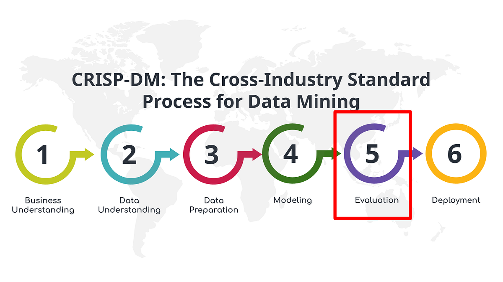
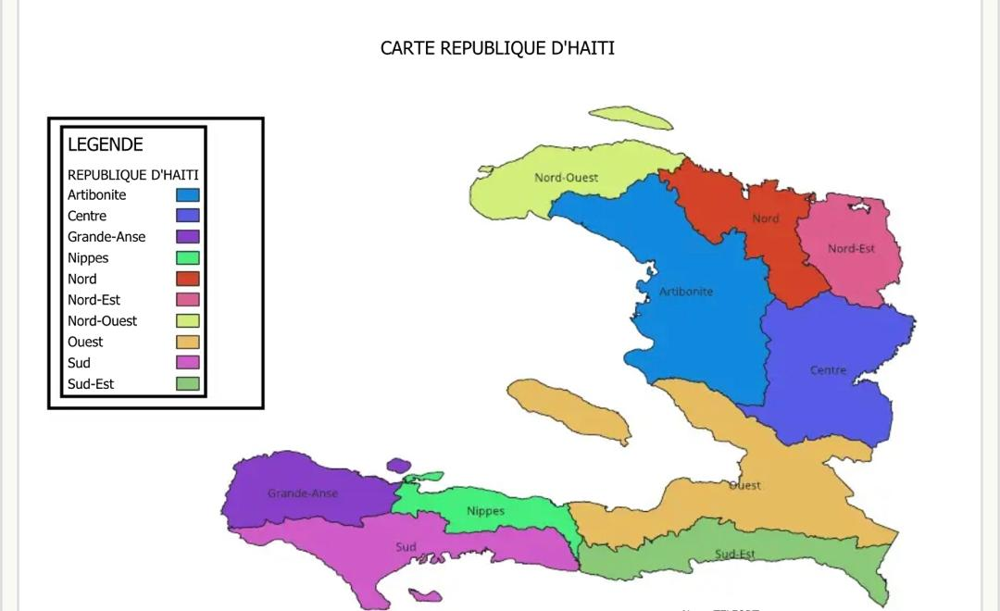

# **Prédiction du risque d’insécurité alimentaire en Haïti**

###  Projet Capstone réalisé dans le cadre du Bootcamp de Data Science & Intelligence Artificielle 
    
    
### Akademi (powered by Flatiron School)
 

  
    
    
 
**Rédigé par :**  
                **Richecard Blade DAMEUS** & **Berothely THELUS**

**Sous la supervision de :**  
    M. Wedter JEROME & M. Geovany LAGUERRE

 

**Date de présentation :** Octobre 2025  
 
**Localisation :** Port-au-Prince, Haïti

## 🎯 Objectif du projet

Ce projet vise à concevoir un **modèle prédictif** capable d’anticiper le **niveau d’insécurité alimentaire** à l’échelle des départements haïtiens, tout en analysant l’influence des indicateurs économiques, climatiques et environnementaux sur ces niveaux.
À partir des données combinées, le modèle doit permettre de :
- Prévoir les phases IPC (1 à 5) associées à chaque département ou commune,
- Identifier les indicateurs clés (prix, pluviométrie, NDVI, taux de change, etc.) qui expliquent la dégradation ou l’amélioration des conditions alimentaires,
- Fournir un outil d’aide à la décision pour anticiper les crises et orienter les interventions préventives.

## 🧾 Résumé du travail

En Haïti, l’insécurité alimentaire persiste dans un contexte marqué par des crises climatiques, économiques et sécuritaires (les groupes armés en Haïti ont ravagé des champs agricoles et entravent l’accès à l’aide alimentaire dans le pays).
Pour y répondre, ce projet utilise la data science pour anticiper les risques à l’échelle communale. Il s’appuie sur des données du système Joint Monitoring Report (JMR) et du Integrated Food Security Phase Classification (IPC) pour construire un modèle supervisé capable d’identifier les zones à haut risque, contribuant ainsi à une meilleure planification humanitaire et agricole. 

Le projet vise à offrir un outil concret d’aide à la décision pour renforcer la résilience alimentaire et mieux orienter les interventions humanitaires en Haïti.

## 🧠 Méthodologie utilisée

Le projet repose sur la méthodologie **CRISP-DM**, reconnue pour sa rigueur et sa clarté dans la conduite des projets de *Data Science*.  
Cette approche couvre tout le processus analytique, depuis la compréhension du problème jusqu’à la restitution des résultats.

    
     
 

La carte suivante présente la structure administrative du territoire haïtien ainsi que le périmètre d’analyse retenu pour ce projet

    
     
    <em>Figure 1 — Carte d’Haïti : zones d’étude pour la prédiction du risque d’insécurité alimentaire.</em>

### **Mots-clés :**  
`Data Science` · `Machine Learning` · `Sécurité alimentaire` · `Haïti` · `CRISP-DM` · `Classification` · `Analyse prédictive`

# Partie 1 – Compréhension du domaine *(Business Understanding)*

## 🎯 Contexte et justification

Depuis plusieurs années, Haïti fait face à une **crise alimentaire profonde**.  
Les épisodes de sécheresse, les inondations répétées, la dégradation des sols, la hausse des prix des denrées et la baisse de la production locale se conjuguent à une **insécurité grandissante** dans plusieurs régions rurales.  

Les récents événements survenus dans la Plaine de l’Artibonite, le Bas-Sud et certaines zones du Nord-Est en sont une illustration :  
des **groupes armés ont incendié ou pillé des champs de riz, de maïs et de haricots**, détruisant plusieurs récoltes et forçant des familles à abandonner leurs terres.  
Ces attaques, relevées par le **Programme Alimentaire Mondial (PAM)**, aggravent une situation déjà fragile : près de **six millions de personnes** sont aujourd’hui exposées à un risque aigu d’insécurité alimentaire.  

Les conséquences ne sont pas uniquement économiques.  
La perte de moyens de subsistance, l’exode rural, la dépendance accrue à l’aide humanitaire et la hausse du coût de la vie créent un cercle vicieux qui érode les bases mêmes de la sécurité alimentaire nationale.  
Dans ce contexte, disposer d’un outil capable d’**anticiper les zones à haut risque** devient essentiel pour permettre aux décideurs de **planifier et cibler leurs interventions** avant que la crise ne s’installe.

Selon la capsule matinale de ProFin diffusée le 23 octobre 2025, la Communauté des Caraïbes (CARICOM) et l’Argentine ont entamé des discussions autour de nouveaux partenariats stratégiques en matière de sécurité alimentaire et d’opportunités de coopération agroalimentaire pour la région caribéenne. Ces échanges visent à renforcer les chaînes régionales de production et de distribution, avec des retombées économiques et agricoles potentielles pour Haïti, notamment à travers le développement de filières locales intégrées et la promotion d’une autosuffisance alimentaire durable.
Cette orientation régionale, axée sur l’autosuffisance alimentaire, s’accorde directement avec les ambitions de ce projet.  

Sur le plan national, plusieurs initiatives soutiennent déjà cette dynamique :  
- Le **Programme National de Cantines Scolaires (PNCS)**, appuyé par le **Programme Alimentaire Mondial**, achète chaque mois pour environ **1,7 million USD** de produits issus de la production locale.  
  Ce modèle, inspiré du *Home-Grown School Feeding*, relie écoles et agriculteurs tout en stimulant les économies rurales.  
- À l’occasion de la Journée internationale des femmes rurales, célébrée le 15 octobre 2025, le Ministère de l’Agriculture, des Ressources Naturelles et du Développement Rural (MARNDR), en collaboration avec la FAO rappelle que plus de 70% des agriculteurs en Haïti sont des femmes pourtant freinées par l’accès à la terre, au crédit et aux circuits formels.
  Renforcer leur participation est une condition incontournable pour restaurer la productivité et la résilience alimentaire du pays.  

Sur le plan international, ce projet s'inscrit dans les Objectifs de Développement Durable (ODD) des Nations Unies, en particulier les ODD 2 (Faim zéro) et ODD 13 (Lutte contre les changements climatiques), qui sont essentiels pour la durabilité et la résilience des systèmes alimentaires mondiaux. Le ODD 2, qui vise à éradiquer la faim et garantir la sécurité alimentaire pour tous, trouve une application directe dans notre projet, qui utilise la data science pour anticiper les risques alimentaires à travers la prédiction des crises alimentaires et l’identification des zones vulnérables en Haïti. En offrant un outil prédictif aux acteurs humanitaires et institutionnels, notre projet contribue à renforcer la planification préventive et à améliorer l'accès à la nourriture dans les zones les plus exposées.

De plus, l’ODD 13, qui appelle à la lutte contre les changements climatiques, est également au cœur de notre démarche. En utilisant des données climatiques telles que les précipitations, les températures, et les périodes de sécheresse, nous visons à renforcer la résilience climatique des communautés haïtiennes. Les effets du changement climatique, notamment les cyclones et les sécheresses prolongées, affectent gravement la production agricole et exacerbent l’insécurité alimentaire. En permettant une meilleure anticipation de ces événements grâce à des modèles prédictifs fiables, ce projet cherche à adopter des solutions d’adaptation pour atténuer les effets du changement climatique sur la sécurité alimentaire.

Ces initiatives montrent qu’il existe déjà un élan de transformation du système agricole haïtien.  
Le projet vient s’y inscrire en apportant une **dimension scientifique et prédictive**, permettant d’appuyer ces efforts par la donnée et l’analyse.

---

## 💡 Problématique 

> Comment anticiper les zones à haut risque d’insécurité alimentaire en Haïti à partir de données climatiques, géographiques et socio-économiques, afin d’aider les autorités et les partenaires à agir avant la crise ?

Cette question résume l’essence du projet : passer d’une **réaction tardive** à une **prévention éclairée par la donnée**.

---

## Hypothèse 
Les indicateurs climatiques (pluie, NDVI, sécheresse) et d’accessibilité influencent significativement le risque d’insécurité alimentaire.

---
## ⚙️ Objectifs spécifiques

1. **Identifier les facteurs déterminants** (pluviométrie, production agricole, variables climatiques, accès aux marchés, structure des ménages, etc.) liés à l’insécurité alimentaire.  
2. **Concevoir un modèle d’apprentissage supervisé** capable d’estimer la phase IPC de chaque commune à partir de données observées.  
3. **Évaluer les performances du modèle** à l’aide de métriques rigoureuses.
4. **Proposer un cadre analytique reproductible**, pouvant être utilisé par les institutions publiques et les ONG pour le suivi à long terme.

---

## 🧭 Vision du projet

Ce travail repose sur la conviction que la **donnée peut devenir un levier de souveraineté alimentaire**.  
En exploitant la méthode **CRISP-DM**, le projet relie l’analyse scientifique à l’action publique.  
L’ambition n’est pas seulement de prédire : il s’agit de **comprendre les dynamiques qui nourrissent l’insécurité alimentaire**, d’en suivre les évolutions dans le temps et d’offrir un outil concret d’aide à la décision.  

Cette démarche veut contribuer à la **construction d’une politique alimentaire plus résiliente**, centrée sur la valorisation de la production locale, la sécurité des zones rurales et la justice économique pour les communautés agricoles.

---

  Acteurs clés du système alimentaire haïtien

| Catégorie                   | Acteurs principaux                                     | Rôle dans la sécurité alimentaire                                      |
|:--------------------------- |:------------------------------------------------------ |:------------------------------------------------------------------------|
| **Institutions nationales** | MARNDR, PNCS, CNSA                                     | Planification, coordination, achats locaux                              |
| **Organisations internationales** | FAO, PAM, CARICOM, WFP                          | Financement, assistance technique, distribution                         |
| **Producteurs ruraux**      | Coopératives agricoles, femmes agricultrices           | Production, transformation, résilience locale                           |
| **Collectivités locales**   | Mairies, CASEC, délégations départementales            | Gestion territoriale, identification des zones vulnérables              |
| **Communautés**             | Écoles, ménages, associations locales                  | Bénéficiaires directs, sensibilisation et participation communautaire   |

# Partie 2 – Compréhension des données *(Data Understanding)*

Cette phase vise à comprendre la nature, la structure et la signification des données disponibles avant toute modélisation.
Elle consiste à examiner leur origine, leur fiabilité, leur cohérence et leur potentiel d’analyse.
Dans le cadre de ce projet, 2 sources principales pour 3 datasets ont été exploitées :

1. Les données du Joint Food Security Monitor - Haiti de la part de la Banque Mondiale
    1. Les données du Joint Monitoring Report (JMR)
    2. Le référentiel géographique administratif (PCodes)   
2. Le jeu de données du système IPC (Integrated Food Security Phase Classification).

Ces trois jeux de données forment un socle d’analyse combinant la dimension temporelle, la dimension spatiale et la dimension structurelle de l’insécurité alimentaire en Haïti.

# Phase 3 – Préparation des données (Data Preparation)

Cette phase marque le passage entre la compréhension des données et la construction du modèle. De ce fait, au cours de cette étape, on va essayer de rendre les données exploitables pour la modélisation.  
C’est ici que l’on va :
- Nettoyer et harmoniser les données issues des différentes sources,  
- Les fusionner pour former un jeu de données complet,  
- Explorer en profondeur les relations entre variables,   
- Identifier les **variables explicatives (features)** et la **variable cible (target)** avant la modélisation..

# Phase 4 — Modélisation (Modeling)

Cette phase vise à construire et à évaluer un **modèle prédictif supervisé**
permettant d’estimer la **phase d’insécurité alimentaire (IPC)** à partir des
indicateurs issus du *Joint Monitoring Report (JMR)*.

La démarche suit une approche scientifique en quatre étapes :
1. Séparation des données en features et target ;  
2. Division du jeu de données en ensembles d’entraînement et de test ;  
3. Construction, apprentissage et évaluation de plusieurs modèles ; 

# Phase 5 — Évaluation et validation du modèle

Dans cette phase, on a vérifier si le modèle qu'on a construit est réellement fiable pour anticiper le niveau d’insécurité alimentaire (Phase IPC) dans les départements et communes d’Haïti.

L’objectif n’est pas seulement d’avoir un bon score mathématique. L’objectif est de pouvoir répondre à une question opérationnelle très simple :

> Est-ce que nous pouvons utiliser ce modèle pour dire à une autorité (Agriculture, CNSA, PAM) :
> « Attention, telle commune risque de passer en phase critique » ?

Pour répondre sérieusement à cette question, on va :
1. mesurer la précision des prédictions,
2. vérifier que le modèle ne triche pas (surapprentissage),
3. étudier les erreurs de prédiction,
4. relier les résultats à la réalité du terrain (prix alimentaires, sécheresse, pluie).

La phase 5 n’est donc pas seulement technique. C’est la phase où on juge si le modèle peut vivre dans le monde réel.

## 5.1 Performance prédictive du modèle sur des données jamais vues

Dans cette section, on teste le modèle sur des données qu’il n’a pas vues pendant l’entraînement.  

On mesure trois choses :
- **MAE (Mean Absolute Error)** : l’erreur moyenne absolue entre la phase réelle et la phase prédite.
- **RMSE (Root Mean Squared Error)** : pénalise plus fort les grosses erreurs.
- **R²** : quelle part de la variation de la phase IPC est expliquée par nos indicateurs.

Plus MAE et RMSE sont bas, mieux c’est.  
Plus R² est haut, mieux c’est.

4. Sélection du modèle final et analyse de ses performances.

